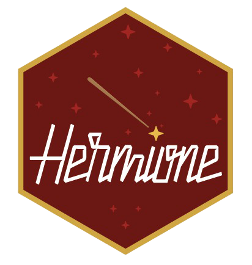

<!-- README.md is generated from README.Rmd. Please edit that file -->

```{r, include = FALSE}
knitr::opts_chunk$set(
  collapse = TRUE,
  comment = "#>",
  fig.path = "man/figures/README-",
  out.width = "100%"
)
```

# hermione



<!-- badges: start -->
[](https://travis-ci.org/mrc-ide/hermione)
[](https://codecov.io/gh/mrc-ide/hermione?branch=master)
<!-- badges: end -->

The goal of hermione is to do robust estimation of serial interval in the presence of biases in data.

## Installation

You can install the development version of hermione from [GitHub](https://github.com/) with:

``` r
# install.packages("devtools")
remotes::install_github("mrc-ide/hermione")
```
