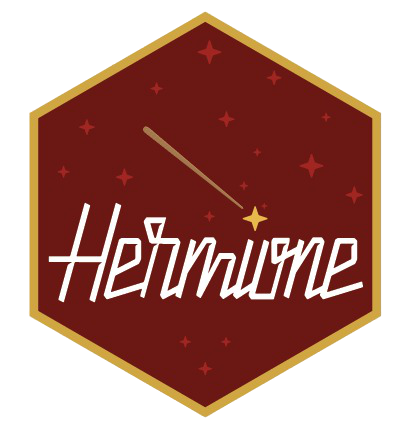

<!-- README.md is generated from README.Rmd. Please edit that file -->

# hermione



<!-- badges: start -->

<!-- badges: end -->

The goal of hermione is to do robust estimation of serial interval in
the presence of biases in data.

## Installation

You can install the development version of hermione from
[GitHub](https://github.com/) with:

``` r
# install.packages("devtools")
remotes::install_github("mrc-ide/hermione")
```
